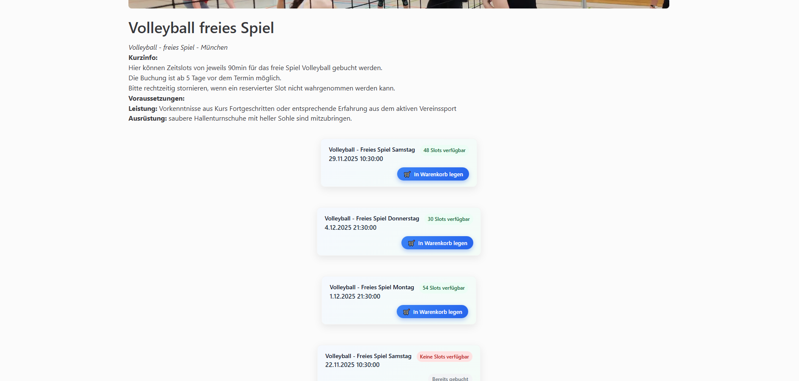
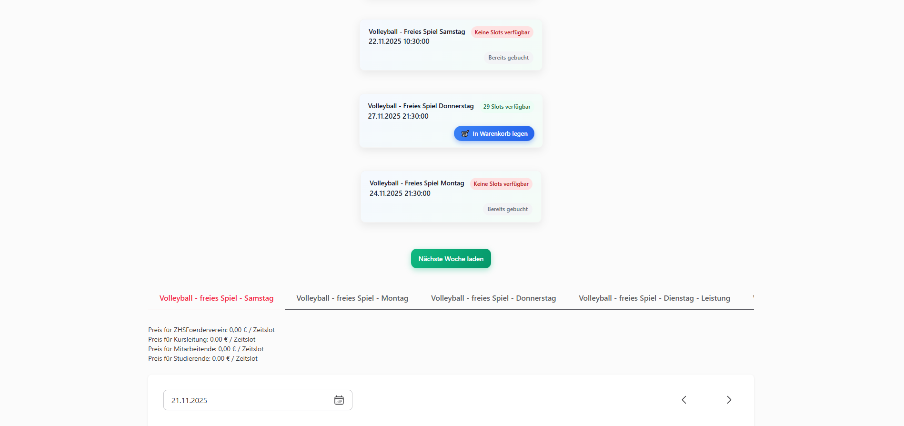

# ZHS Booking Extension

Eine Chrome-Extension zur vereinfachten Buchung von **slotbasierten ZHS-Kursen**.
Sie basiert auf der Library [zhs-client-js](https://www.npmjs.com/package/zhs-client-js) und zeigt automatisch Kursdetails, Slot-Verfügbarkeiten und Buchungsoptionen direkt auf den ZHS-Angebotsseiten an.

---

## ✨ Features

* **Automatische Kurserkennung** anhand der URL
* **Live-Verfügbarkeit** für Slot-basierten Kurse
* **Direkte Buchung** per „In Warenkorb legen“-Button (**mehrere Wochen voraus möglich**)

<!--  -->
---

## 📦 Installation

Zwei Möglichkeiten:

### **1. ZIP-Download (ohne Build)**

1. Projekt als ZIP herunterladen
2. ZIP **entpacken**
3. In Google Chrome Einstellungen für Extensions öffnen:
   [chrome://extensions](chrome://extensions) → „**Entwicklermodus**“ aktivieren → **„Entpackte Erweiterung laden“**
4. Den Ordner **`zhs-booking-extension`** auswählen

---

### **2. Selbst builden**

1. Dependencies installieren
   '''
   npm install
   '''
2. Build erzeugen
   '''
   npm run build
   '''
3. In Chrome laden:
   **chrome://extensions** → „Entpackte Erweiterung laden“
4. Den Ordner **`zhs-booking-extension`** auswählen

---

## 🛠️ Development Mode

Für Live-Entwicklung mit automatischem Re-Bundling:

'''
npm run dev
'''

Dann die Extension in Chrome manuell neu laden/aktualisieren.

---

## 🏗️ Struktur (Kurzüberblick)

* **content.js** – Kernlogik für Slot-Prüfung, Kursnavigation & UI-Rendering
* **styles.js** – Injected CSS für Karten & Buttons
* **banner.js** – Minimaler Hinweisbanner
* **manifest.json** – Chrome Manifest v3
* **webpack** – Bundling der Content Scripts

---

Readme.md erstellt über ChatGPT5.1
